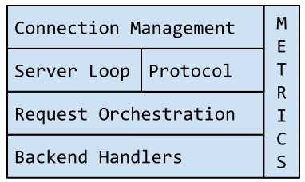

# Rend: Memcached-Compatible Server and Proxy

[](https://gitter.im/Netflix/rend?utm_source=badge&utm_medium=badge&utm_campaign=pr-badge&utm_content=badge) [](https://godoc.org/github.com/netflix/rend) [](https://goreportcard.com/report/github.com/netflix/rend)

Rend is a proxy whose primary use case is to sit on the same server as both a [memcached](https://github.com/memcached/memcached) process and an SSD-backed L2 cache. It is written in [Go](https://github.com/golang/go) and is under active development at Netflix. Some more points about Rend:

 * Designed to handle tens of thousands of concurrent connections
 * Speaks a subset of the memcached text and binary protocols
 * Comes with a load testing and correctness testing client package
 * Modular design to allow different pieces to be replaced
   * See [rend-lmdb](https://github.com/netflix/rend-lmdb) for an example

Rend is currently in production at Netflix and serving live member traffic.

## Motivation

Caching is used several ways at Netflix. Some people use it as a true working set cache, while others use it as the only storage mechanism for their service. Others use it as a session cache. This means that some services can continue as usual with some data loss, while others will permanently lose data and start to serve fallbacks. Rend is built to complement [EVCache](https://github.com/Netflix/EVCache), which is the main caching solution in use at Netflix.

The genesis of Rend starts with Memcached memory management. Internally, Memcached keeps a set of slabs for different size data. Slabs are logical groupings of pages, which are a fixed size set on startup. Pages map to physical memory and are split based on the slab's data size. In versions 1.4.24 and prior, pages were permanently allocated to a particular slab and never released even if empty. As well, if there were many holes in the data in RAM, there was no compaction and therefore memory could get very fragmented over time. This has changed over time, and now this is less of a problem than it was before.

The second half of the story is within Netflix. Every night, a big batch process computes recommendations for each of our members in multiple steps. Each of these steps loads their output into EVCache. An underlying data source changed one day in such a way that caused the output of one batch compute process to change drastically in size. When the data set was being written to the cache, it was different enough in size to land in a different Memcached slab. The cache was sized to hold one copy of the data, not two, so when the new data was written, the memory filled completely. Once full, Memcached started evicting large portions of newly-computed data while holding on to mostly empty memory in a different slab.

So what was the solution? Take the incoming data and split it into fixed-size chunks prior to inserting into Memcached. This bypassed the complication of the slab allocator. If everything is the same size, there will never be holes that are out of reach for new data. This hardened us against future data changes, which are inevitable. Rend (which means "to tear apart") is the server-side solution to this problem, which also enables much more intelligence on the server.

## Components

Rend is a server and a set of libraries that can be used to compose a Memcached-compatible server of your own. It consists of packages for protocol parsing, a server loop, request orchestration (for L1 / L2 logic), and a set of handlers that communicate with the backing storage. It also includes a metrics library that is unintrusive and fast. The memproxy.go file acts as the main function for Rend as a server and showcases the usage of all of the available components.



## Setup and Prerequisites

### Dependencies

To just get started, everything needed is in this repository. The Basic Server section shows how to stand up a simple server.

In order to use the proxy in L1-only mode, it is required to have a Memcached-compatible server running on the local machine. For our production deployment, this is Memcached itself. It is always recommended to use the latest version. This version has the full set of features used by the proxy as well as a bunch of performance and stability improvements. The version that ships with Mac OS X does not work (it is very old). You can see installation instructions for Memcached at https://memcached.org.

To run the project in L1/L2 mode it is required to run a Rend-based server as the L2. The logic within Rend uses a Memcached protocol extension (the gete command) to retrieve the TTL from the L2. There's plans to make this optional, but it is not yet.

As well, to build Rend, a working Go distribution is required. The latest Go version is used for development.

### Get the Source Code

    go get github.com/netflix/rend

### Build and Run

Rend doesn't require any special build steps. It also does not have any external dependencies. The Go toolchain is used to build and run.

    go build github.com/netflix/rend
    ./rend

## Basic Server

### Using the default Rend server (memproxy.go)

Getting a basic rend server running is easy:

```bash
go get github.com/netflix/rend
go build github.com/netflix/rend
./rend --l1-inmem
```

To test it, open another console window and use netcat to try it out:
(`>` means typed input)

```bash
$ nc localhost 11211
> get foo
END
> set foo 0 0 6
> foobar
STORED
> get foo
VALUE foo 0 6
foobar
END
> touch foo 2
TOUCHED
> get foo
VALUE foo 0 6
foobar
END
> get foo
END
> quit
Bye
```

It should be noted here that the in-memory L1 implementation is functionally correct, but it is for debugging only. It does not free memory when an entry expires and keeps everything in a simple map with an RWMutex.

### Using Rend as a set of libraries

To get a working debug server using the Rend libraries, it takes 21 lines of code, including imports and whitespace:

```go
package main

import (
    "github.com/netflix/rend/handlers"
    "github.com/netflix/rend/handlers/inmem"
    "github.com/netflix/rend/orcas"
    "github.com/netflix/rend/server"
)

func main() {
    server.ListenAndServe(
        server.ListenArgs{
            Type: server.ListenTCP,
            Port: 11211,
        },
        server.Default,
        orcas.L1Only,
        inmem.New,
        handlers.NilHandler(""),
    )
}
```

## Testing

Rend comes with a separately developed client library under the [`client`](client/) directory. It is used to do load and functional testing of Rend during development.

### [`blast.go`](client/blast.go)

The blast script sends random requests of all types to the target, including:
* `set`
* `add`
* `replace`
* `append`
* `prepend`
* `get`
* batch `get`
* `touch`
* `get-and-touch`
* `delete`

Use the binary Memcached protocol with 10 worker goroutines (i.e. 10 connections) to send 1,000,000 requests with a key length of 5.

    go run blast.go --binary -n 1000000 -p 11211 -w 10 -kl 5

### [`setget.go`](client/setget.go)

Run sets followed by gets, with verification of contents. The data is between 5 and 20k in length.

    go run setget.go --binary -n 100000 -p 11211 -w 10

### [`sizes.go`](client/sizes.go)

Runs sets of a steadily increasing size to catch errors with specific size data. It runs sets from 0 bytes all the way up to 100k for the value.

    go run sizes.go --binary -p 11211

### [`fill.go`](client/fill.go)

Simply sends sets into the cache to test set rate and eviction policy. The following sends 1 billion sets with random 10 character keys on 100 connections:

    go run fill.go --binary -p 11211 -h localhost -kl 10 -w 100 -n 1000000000

### [`setops.go`](client/setops.go)

Sends all different kinds of set operations at the target, including:
* `set`
* `add`
* `replace`
* `append`
* `prepend`

```
go run setops.go --binary -p 11211 -n 1000000 -w 10 -kl 3
```
